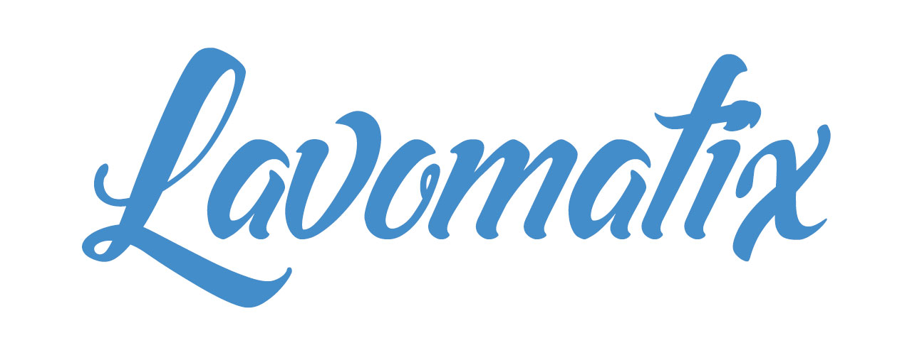

# LAVOMATIX

#### JS/CSS bundler
A simple and conventionnal project structure easy to use.
> scss and babel-preset-env ready with laravel-mix agnostic bundler
> [Laravel Mix](https://laravel-mix.com/docs/2.1/installation)

###  /!\ Word In Progress

### INSTALLATION

```
git clone https://github.com/jcchrrr/lavomatix front
cd front
rm -rf .git
npm install
cp .env_sample .env
```

the ".env" file contains relative configurations. Feel free to edit it.


### USAGE

These scripts will generate files in the ".env" configuration location

```npm run dev``` to generate a dev bundle

```npm run watch``` to launch BrowserSync and watch **./src**

```npm run build``` to generate a prod ready dist folder, minified and sourcemapped

### CAVEATS

- todo

#### Credits and documentation
[Laravel Mix](https://laravel-mix.com/docs/2.1/installation)
